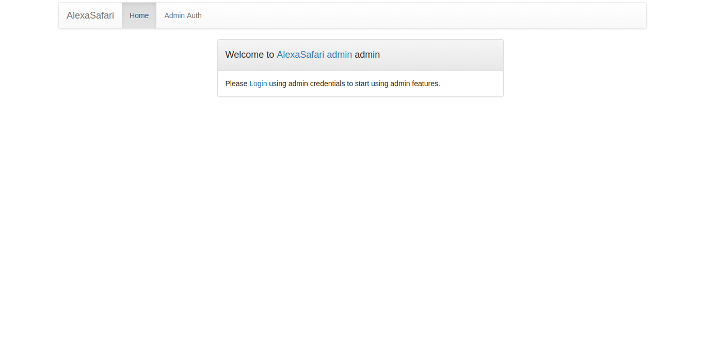
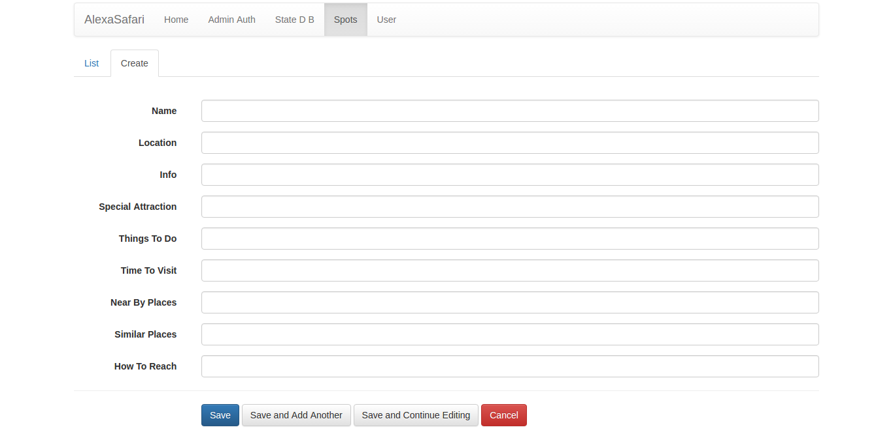

# SafariAlexa

SafariAlexa is an Alexa skill focussed on tourism. The purpose of this skill is to help people to gather various
information on different tourist places from Alexa. This skill will allow Alexa to answer queries like what is the
location of a particulat spot, what is the best time of the year to visit that spot, what are the special attractions
of that place, etc. Instead of searching all these information from various sources on the Internet, users can simply
ask their queries to Alexa and Alexa will answer them.

## How to use the skill
The **invocation phrase** for this skill is **go safari**. So in order to use this skill preceed all your queries with
the phrase go safari.
For example:

**ask go safari what is the location of manali**

or

**ask go safari to give information on manali**

or

**ask go safari what are the things I should do at manali**

or

**ask go safari what are the speacial attractions at manali**

or

**ask go safari to tell me the most suitable time to visit manali**

or

**ask go safari to name some places in manali**

or

**ask go safari to tell me some places similar to manali**

or

**ask go safari how should I reach manali**

## Technology Stack
- Alexa NodeJS kit
- NodeJS
- AWS Lambda
- Python
- Flask
- Flask-admin
- BeautifulSoup
- Heroku

## How the project works
The skill works at three stages, the **Alexa voice user interface (VUI)** stage, the client interacts with Alexa using VUI,
that **lambda function** which runs the app logic for generating alexa response and finally the web app which provides
the REST API from where Alexa fetches all its data.

When the user procvides a voice input, Alexa uses its VUI to handle the user input, and it finds out a particular
**intent** which can serve the user query. Alexa, after determining the appropriate intent and parameter, sends a request
to the lambda function. The lambda function uses the appropriate **handler** to serve the request. The handler actually
makes a API call to the above mentioned REST API to get the required data, generates the response and sends it back to Alexa
VUI.

### The REST API
The REST API provides the neccessary data to server the user requests. The data is provided from a database which needs
to be maintained by an admin.

Example of the REST API:

```
curl 'http://alexasafari.herokuapp.com/api/query_spot?spot=manali&query_type=info'
{
  "info": "Circled by towering peaks in the rich verdant valley of the Beas River, with mountain ventures waving from all directions, Manali is a year-round attraction. Travelers assemble here to hang out in the hippie villages around the main town; adventure seekers come for trekking, climbing, mountain biking, canyoning, paragliding, rafting and skiing; and much more.", 
  "spot_name": "manali", 
  "status": "FOUND"
}
```
**Basic format**

```
http://alexasafari.herokuapp.com/api/query_spot?spot=[name_of_the_spot]&query_type=[type_of_query]
```

where query_type can be any one of the following values

- location
- info
- things_to_do
- special_attraction
- time_to_visit
- near_by_places
- similar_places
- how_to_reach

The webapp maintains a database of tourist spots. The data is added by the admin. The server has two types of provision
to server the requests it receives about spots and query type. If the information about the spot is available in its
database, then it can return the data immidietely. Otherwise the server can employ scrapers to scrape the required
information from the web. Presently the project contains one such scraper, the **bttv_scraper** which finds out the best
time of the year to visit a particular place in case that particular place is not present in the data base.
In future more such scrapers will be added.

The webapp provides a simple and easy to use admin interface to add and maintain the data base. Admin has to login using
his credentials and an authorised admin can add other admins.

<table>
<tr>
<td></td>
</tr>
</table>

<table>
<tr>
<td></td>
</tr>
</table>


